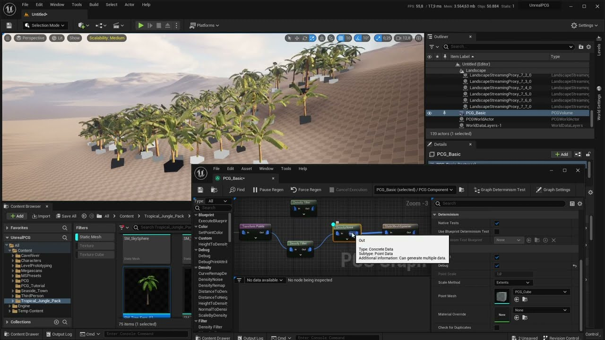
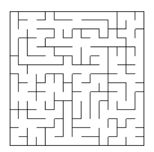
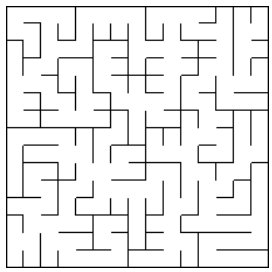
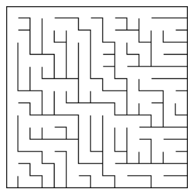
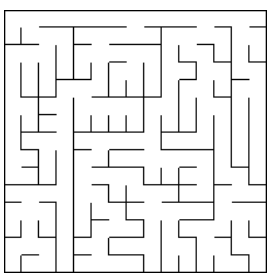

= PCG Engine 

[cols="<,>" frame=none, grid=none]
|===
|xref:Index.adoc[< Index]
|xref:PCG-Engine.adoc[C++ PCG Engine >]
|===

== Introduction

=== What is the **P**rocedural **C**ontent **G**eneration Engine?

The **P**rocedural **C**ontent **G**eneration (PCG) Engine is a C++ library that can be used with other engines like Unity, Unreal or even custom engines by including the engine's DLL to your project.

=== Motivation

Looking at the list of software available on http://pcg.wikidot.com/category-pcg-software[The Procedural Content Generation Wiki] most of them were made during the development of https://store.steampowered.com/app/17390/SPORE/[Spore], which was released back in September 2008 (16 years ago).

Most of the software needs you to learn how to use it before being able to generate content with it. And not all of them support games engines.

For example to use Unreal's new https://dev.epicgames.com/community/learning/tutorials/j4xJ/unreal-engine-introduction-to-procedural-generation-plugin-in-ue5-3[Procedural Generation Plugin] you need to learn how to create a blueprint that will represent what you are trying to generate.

https://www.youtube.com/watch?v=byouBYMuYPw[PCG Basics - Unreal 5.2 Tutorial - Part 1]

Another example is https://sceelix.com[Sceelix] who can be integrated with Unity. You'll still need to learn the Node Graph to be able to generate content.

=== Risks

* The DLL needs to be compatible with the engine/platform (For example Unreal is compiled with C\++ 20. C++ 23 functions like std::to_underlying will cause errors if used). 

* Debugging issues linked to the library is harder and requires having the debug DLL.

* Might be confused with AI and seen as a replacement for Level Designers.

=== Research Question:

Will creators prefer a simple window that allows you to generate levels or models variation with a simple button click?

=== What Does It Offer?

* This library is not here to replace level designer but to facilitate their work flow.

* It allows you to generate content during edit mode and tweak it to fit what you need

* You can also use it during play mode and generate content while the game is playing.

* At the moment you can generate:

** Levels using:

    *** A linear level generation on the specified axes (X,Y,Z)
    
    *** A Wave Function Collapse generation that generates levels on the specified axes (X,Y,Z) where each node will have a path/wall to adjacent nodes.
    
** Mazes
    *** xref:https://weblog.jamisbuck.org/2011/1/17/maze-generation-aldous-broder-algorithm[Aldous Broder's Algorithm] +
    
    
    
    *** xref:https://weblog.jamisbuck.org/2011/1/20/maze-generation-wilson-s-algorithm[Wilson's Algorithm] +
    

    *** xref:https://weblog.jamisbuck.org/2011/2/1/maze-generation-binary-tree-algorithm.html[Binary Tree Algorithm] +
    
  
    *** xref:https://weblog.jamisbuck.org/2011/2/3/maze-generation-sidewinder-algorithm.html[Sidewinder Algorithm] +
    
    
** Combinations:
    
    *** A combination given the number of elements in a list
    
        Given: Fire, Ice, Water, Air, Stone, Poison
        Output: Water, Air, Stone
    
    *** A combination with a given number of minimum elements from a list
    
        Given: Fire, Ice, Water, Air, Stone, Poison
        Minimum: 3 elements
        Output: Fire, Water, Air, Stone
    
    *** A combination that must contain the elements passed in.
    
        Given: Fire, Ice, Water, Air, Stone, Poison
        Included Elements: Fire, Ice, Poison
        Output: Fire, Ice, Water, Air, Poison
    
=== Who Should Use It?

- Ideally game creators who don't have the experience or time to write PCG algorithms.

- Creators who want to add a procedural generation aspect to their game but the core game play loop doesn't revolve around it.

- Artists who want to quickly create variations of their models by using different combinations of hair/outfits/accessories on their characters or have locations with a combination of different landmarks.
    
=== Why Use It?

* As a programmer you'll be able to add procedurally generated content to your games by passing in callbacks that will spawn objects in your game.

* As a designer you'll be able to generate your level with one button click then place your quest items/place of interest for the game.

* As an artist you'll be able to import a model with multiple variations and generate a combination of each variation.

=== Who Shouldn't Use It?

- Games whose core game play loops revolves around PCG. I'd use it as a quick proof of concept to evaluate the game play loop around the generated content. As a programmer I'd rather have direct control over the core game play code.
[NOTE]
Innes McKendrick one of the developers of No Man's Sky speaks about the iteration and algorithms they used for procedural generation in a GDC Talk: https://youtu.be/sCRzxEEcO2Y?si=2CCcCRxETrUeaue_[Continuous World Generation in No Man's Sky]

=== Future Improvements:

* Level Generation:

** Implement Graph Rewriting/Cyclic Generation like in https://youtu.be/LRp9vLk7amg?si=HXGZ2lUwNPR5PqGt[Unexplored]

* Maze Generation:

** Implement Remaining Mazes from Jamis Buck presentation  https://www.jamisbuck.org/presentations/rubyconf2011/index.html#title-page["Algorithm" is Not a Four-Letter Word]

* Combinations:

** Sequence generation: Given a start node choose a random element from a list of next nodes and repeat the process recursively until node is available.

    Speak
        Guildmaster
            Kill
                Goblin
                Orc
                Wolf
            Defend
                Town
        Merchant
            Retrieve
                Stolen Gold
                Amulet of Resistance
        Smith
            Craft
                Sword
                Dagger
                Axe
            Give
                10 Logs
                5 Gold Ingot
    Sequence: Speak -> Merchant -> Retrieve -> Stolen Gold
    Quest Speak to Merchant and retrieve the stolen gold

* Additional Languages

** JavaScript: This engine could be transformed into a REST API  to allow JavaScript engines like PlayCanvas. A GET request will return a JSON containing all of the generated content's information.
[NOTE]
The engine could then change to a Software as a Service (SaaS) by following this model.

** Python and PyGame using https://stackoverflow.com/questions/252417/how-can-i-use-a-dll-file-from-python[ctype]

== How It Works

After adding the unity package/plugin to Unity/Unreal new editor windows will be added to the engine. Each window represents a functionality of the engine (Level Generation, Maze Generation, Combination Generation...).

Each exposed function in the API takes a callback function that will be called when a node is generated:

* For level generation the position will be passed to the callback.

* For Wave Function Collapse and mazes the position and a flag of available neighbours is passed in.

* For combinations the index of the element and a boolean indicating if it's in the set or not will be passed in.

Since Random Number Generators are the core of procedural content, The RNG function can be set to a user defined function that will be used with the given seed to generate content.
