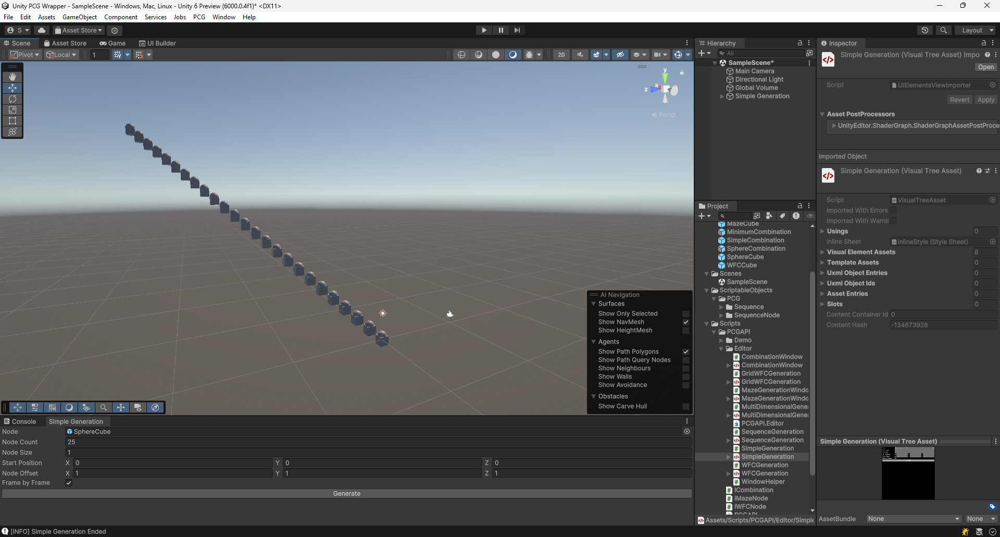

# Unity Package

[cols="<,>" frame=none, grid=none]
|===
|xref:./../Wrappers/Python-Wrapper.adoc[< Python Wrapper]
|xref:./Unreal.adoc[Unreal Plugin >]
|===

== Description

The Unity package contains:

- **The C# Wrapper DLLs:** The C# Wrapper can be used with Unity during play mode to generate content procedurally.

- **The PCGAPI.Editor and PCGAPI.Demo Assemblies:** The PCGAPI.Editor assembly adds editor windows to invoke the C# Wrapper functions and generate content during edit mode.
 
== PCG Windows

=== Overview

The Windows are added to the PCG Menu item.

=== Level Generation

=== Simple Generation

==== Inputs

- **Node:** GameObject spawned to create level.

- **Node Count:** Number of nodes spawned.

- **Node Size:** Size of spawned GameObject.

- **Start Position:** Position of starting node.

- **Node Offset:** Offset between spawned GameObjects.

- **Frame by Frame:** Spawn one node per frame or entire level in one frame.

=== Multi Dimension Generation

==== Inputs

- **Node:** GameObject spawned to create level.

- **Node Count:** Number of nodes spawned.

- **Node Size:** Size of spawned GameObject.

- **Seed:** Seed used to generate level.

- **Disable Overlap:** Prevent nodes spawning on top of one another.

- **Start Position:** Position of starting node.

- **Axes:** Axes used to spawn level.

- **Frame by Frame:** Spawn one node per frame or entire level in one frame.

==== Wave Function Collapse Generation

==== Inputs

- **Node:** GameObject that has a component inheriting from IWFCNode will be spawned to create level.

- **Node Count:** Number of nodes spawned.

- **Node Size:** Size of spawned GameObject.

- **Seed:** Seed used to generate level.

- **Start Position:** Position of starting node.

- **Axes:** Axes used to spawn level.

- **Expansion Mode:** Choose between a Breadth-First Search(Circular Shape Level) and Depth-First Search (More Linear Shape Level)

- **Frame by Frame:** Spawn one node per frame or entire level in one frame.

=== Grid Wave Function Collapse Generation

==== Grid 2D

==== Grid 3D

==== Inputs

- **Node:** GameObject that has a component inheriting from IWFCNode will be spawned to create grid.

- **Node Size:** Size of spawned GameObject.

- **Seed:** Seed used to generate grid.

- **Grid Dimension:** Choose between a 2D grid and a 3D grid.

- **Plane:** Plane on which the 2D grid spawned.

- **Grid Size:** The grid dimension on each axis

- **Frame by Frame:** Spawn one node per frame or entire grid in one frame.

=== Maze Generation

==== Inputs

- **Maze Node:** GameObject that has a component inheriting from IMazeNode will be spawned to create grid.

- **Grid Size:** Size of generated grid.

- **Node Size:** Size of spawned GameObject.

- **Seed:** Seed used to generate maze.

- **Maze Algorithm:** Algorithm used to generate maze.

- **Frame by Frame:** Spawn one node per frame or entire grid in one frame.

- **Delayed Invoke:** Spawn nodes after maze is generated.

=== Combination / Sequence Generation

=== Combination Generation

==== Inputs

- **Combination Object:** GameObject that has a component inheriting from ICombination.

- **Seed:** Seed used to generate combination.

=== Sequence Generation

==== Linear Sequence

==== Cyclic Sequence

==== Inputs

- **Start Node:** First node in sequence.

- **File Name:** Name of generated Sequence ScriptableObject.

- **Folder Path:** Folder where generated sequence is saved.

- **Cyclic Generation:** Enable cyclic sequences.

- **Sequence Length:** Length of cyclic sequence.

- **Seed:** Seed used to generate sequence.
