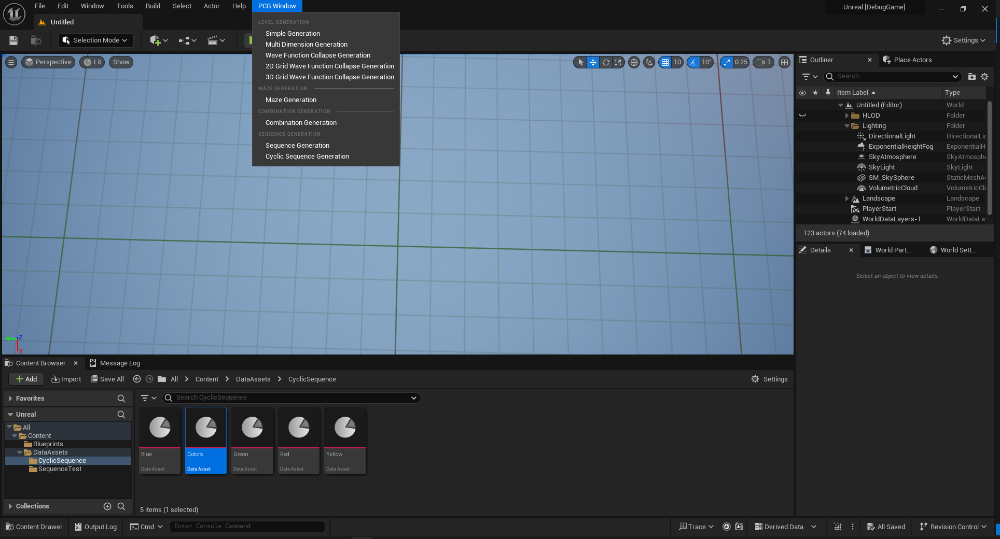
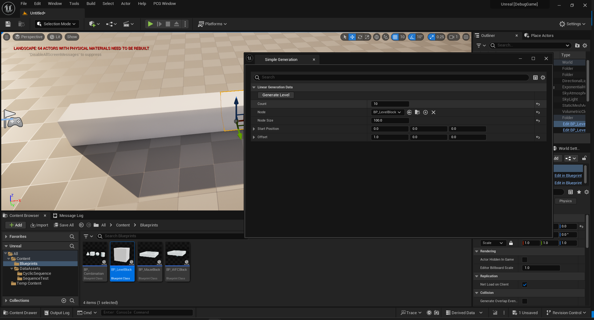
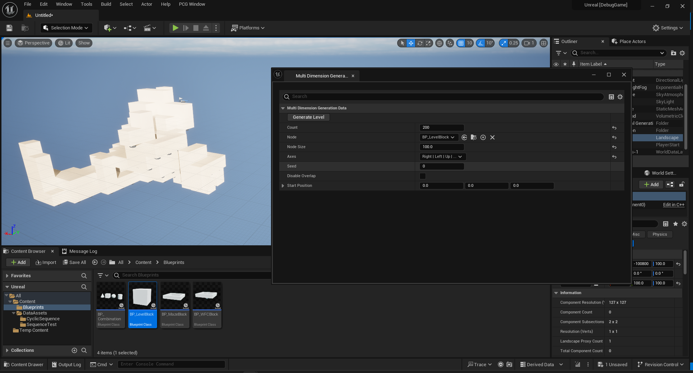
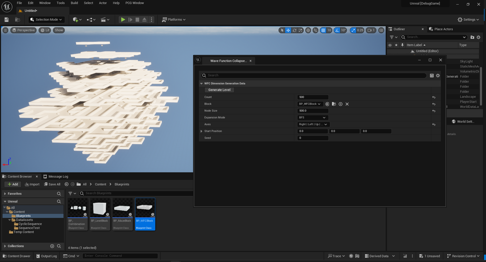
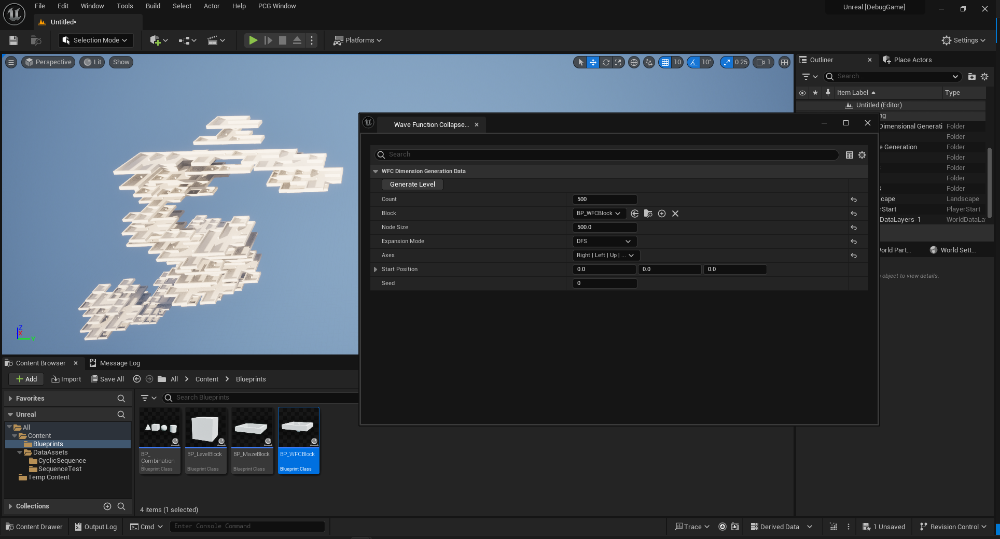
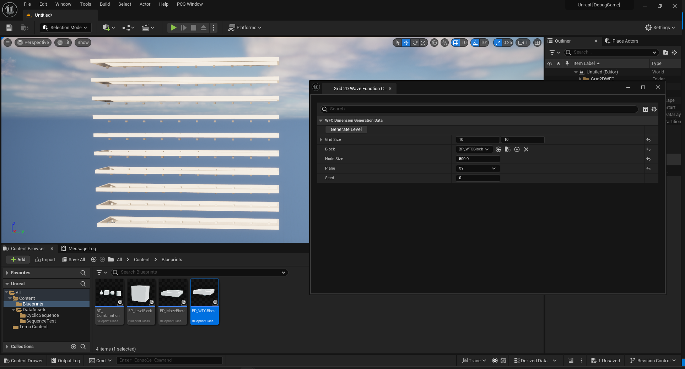
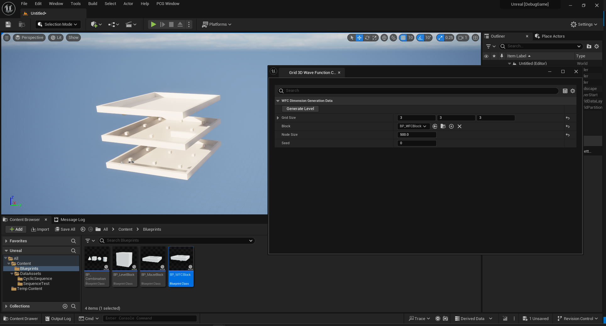
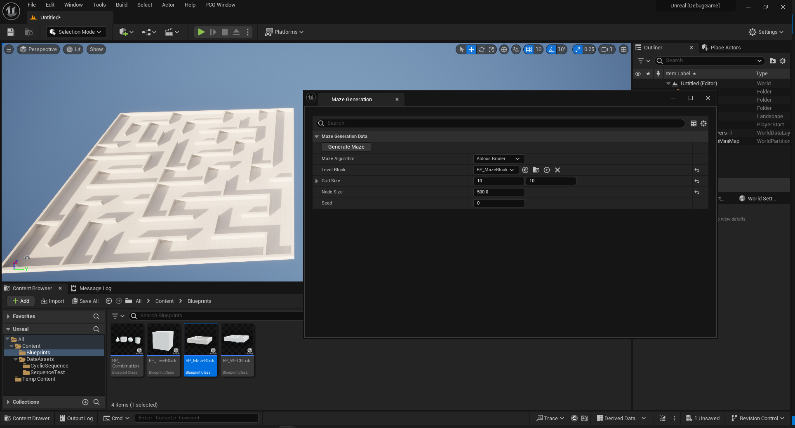
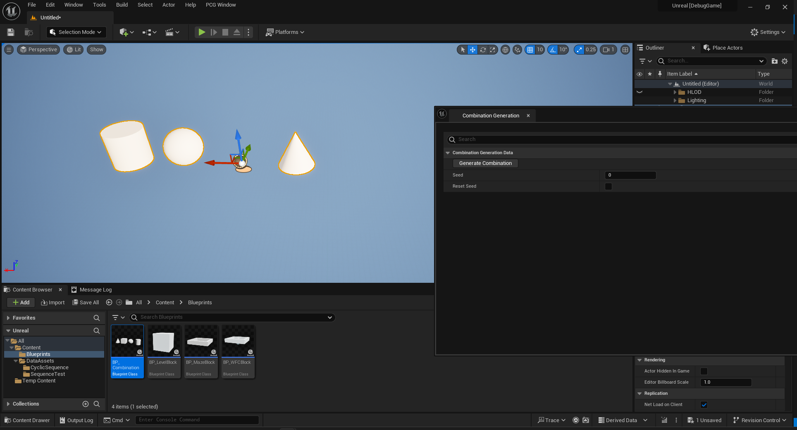
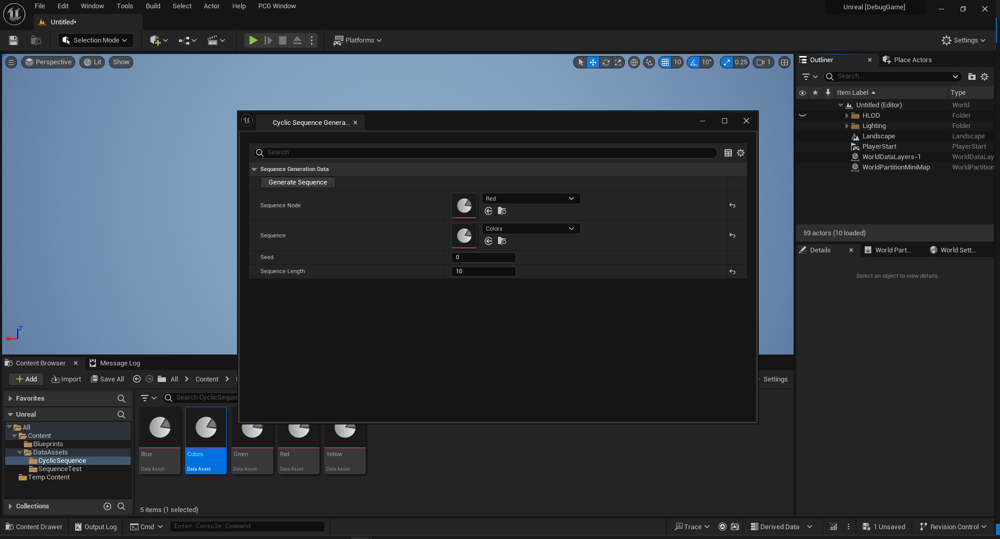

# Unreal Plugin

[cols="<,>" frame=none, grid=none]
|===
|xref:./Unity.adoc[< Unity Package]
|xref:./../Web/Web-Api.adoc[PCG Engine Web API >]
|===

== Description

The Unreal plugin contains:

- **My PCG Plugin:** This plugin adds the C++ PCG Engine library to the Unreal project and contains some helper functions to convert from the PCG Engine library to Unreal.

- **PCG_Window Plugin:** This Plugin adds editor windows to invoke the PCG library and generate content during edit mode.

== PCG Windows

=== Overview

The windows are added to the PCG Window menu item.

=== Level Generation

=== Simple Generation

==== Inputs

- **Count:** Number of nodes spawned.

- **Node:** Actor spawned to create level.

- **Node Size:** Size of spawned Actor.

- **Start Position:** Position of starting node.

- **Offset:** Offset between spawned Actors.

==== Multi Dimension Generation

==== Inputs

- **Count:** Number of nodes spawned.

- **Node:** Actor spawned to create level.

- **Node Size:** Size of spawned Actor.

- **Axes:** Axes used to spawn level.

- **Seed:** Seed used to generate level.

- **Disable Overlap:** Prevent nodes spawning on top of one another.

- **Start Position:** Position of starting node.

==== Wave Function Collapse Generation

==== Inputs

- **Count:** Number of nodes spawned.

- **Block:** BP that inherits from IWFCNode that will be spawned to create level.

- **Node Size:** Size of spawned Actor.

- **Expansion Mode:** Choose between a Breadth-First Search(Circular Shape Level) and Depth-First Search (More Linear Shape Level)

- **Axes:** Axes used to spawn level.

- **Start Position:** Position of starting node.

- **Seed:** Seed used to generate level.

=== Grid Wave Function Collapse Generation

==== Grid 2D

==== Grid 3D

==== Inputs

- **Grid Size:** The grid dimension on each axis.

- **Block:** BP that inherits from IWFCNode that will be spawned to create level.

- **Node Size:** Size of spawned Actor.

- **Plane:** Plane on which the 2D grid spawned.

- **Seed:** Seed used to generate grid.

==== Maze Generation

==== Inputs

- **Maze Algorithm:** Algorithm used to generate maze.

- **Level Block:** BP that inherits from IMazeNode that will be spawned to create level.

- **Grid Size:** Size of generated grid.

- **Node Size:** Size of spawned Actor.

- **Seed:** Seed used to generate maze.

=== Combination / Sequence Generation

==== Combination Generation

[NOTE]
This windows affects the selected actors in the level.

==== Inputs

- **Seed:** Seed used to generate combination.

- **Reset Seed:** Reset the seed to the selected seed.

==== Sequence Generation

==== Inputs

- **Sequence Nodes:** First node in sequence.

- *Seed:** Seed used to generate sequence.

==== Cyclic Sequence Generation

==== Inputs

- **Sequence Node:** First node in sequence.

- **Sequence:** Data asset containing generated sequence.

- **Seed:** Seed used to generate sequence.

- **Sequence Length:** Length of generated sequence.
